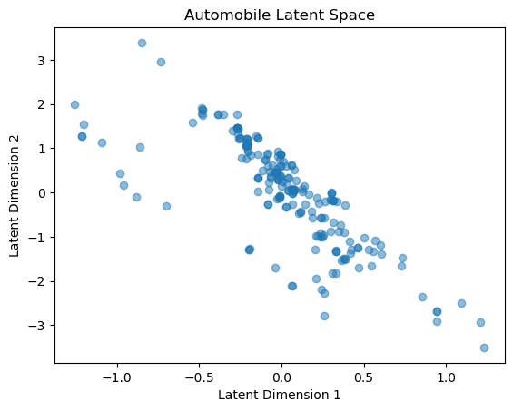
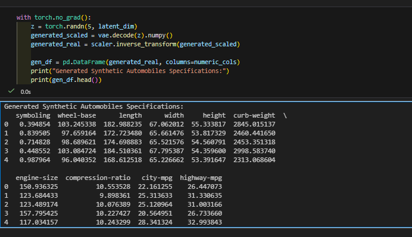

# Automobile Data Generation using Variational Autoencoders (VAE) 🚗🤖

This project demonstrates the power of **Generative AI** applied to tabular data. Using PyTorch, I built a Variational Autoencoder (VAE) to compress automobile specifications into a low-dimensional latent space and generate new, synthetic car data.

## 📌 Project Overview
The goal was to move beyond simple data compression (Autoencoders) to data generation (VAEs). The model learns the underlying probability distribution of car features such as horsepower, engine size, price, and fuel efficiency.

## 🚀 Features
- **Data Preprocessing:** Handled missing values and performed feature scaling for 26+ attributes.
- **VAE Architecture:** Implemented a custom Encoder-Decoder bottleneck with the **Reparameterization Trick**.
- **Latent Space Visualization:** Mapped complex car specs into a 2D plane to discover hidden patterns.
- **Synthetic Data Generation:** Generated completely new automobile records that follow realistic physical constraints.

## 📊 Results

### 1. Latent Space Representation
The model successfully clustered similar vehicles together. This proves that the latent space is continuous and structured.
 

### 2. Generated Data (Samples)
The Decoder can generate realistic synthetic samples by sampling from the learned Gaussian distribution.

## 💡 Key Insights
- **Why VAE?** Unlike standard Autoencoders, VAEs ensure the latent space is organized, allowing us to sample new points and get meaningful results.
- **Real-world Use:** This can be used for **Data Augmentation** in industries with small datasets or for **Anomaly Detection** in manufacturing.

## 🛠️ Tech Stack
- **Language:** Python
- **Library:** PyTorch
- **Tools:** Pandas, Scikit-learn, Matplotlib

## 📝 How to Run
1. Clone the repo: `git clone https://github.com/your-username/automobile-vae.git`
2. Install dependencies: `pip install torch pandas matplotlib scikit-learn`
3. Run the notebook/script to train and visualize.

---
*Created as part of my journey in Deep Learning and Generative Models.*
